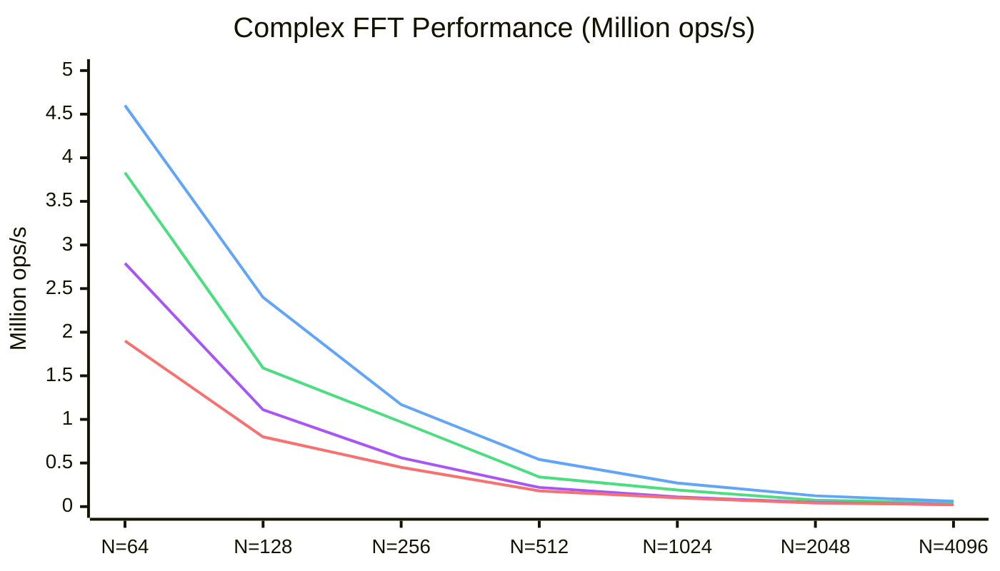
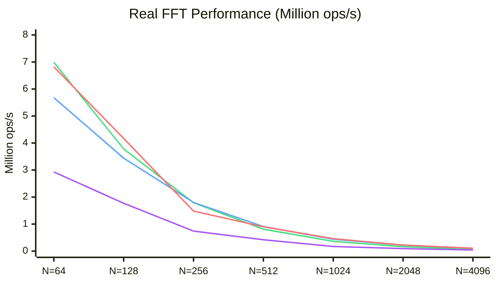

# wat-fft

A high-performance FFT implementation in WebAssembly Text format that **significantly outperforms popular JavaScript FFT libraries**.

## Performance

### Complex FFT

Benchmarked against [fft.js](https://github.com/indutny/fft.js) (fastest pure-JS FFT):

| Size   | wat-fft (f64)       | fft.js          | Speedup  |
| ------ | ------------------- | --------------- | -------- |
| N=64   | **3,830,000 ops/s** | 2,794,000 ops/s | **1.4x** |
| N=128  | **1,586,000 ops/s** | 1,105,000 ops/s | **1.4x** |
| N=256  | **973,000 ops/s**   | 559,000 ops/s   | **1.7x** |
| N=512  | **344,000 ops/s**   | 223,000 ops/s   | **1.5x** |
| N=1024 | **191,000 ops/s**   | 113,000 ops/s   | **1.7x** |
| N=2048 | **74,500 ops/s**    | 47,200 ops/s    | **1.6x** |
| N=4096 | **44,400 ops/s**    | 23,400 ops/s    | **1.9x** |



> 🟢 **wat-fft f64** · 🔵 **wat-fft f32** · 🟣 **fft.js** · 🔴 **kissfft-js**

**Choose f64** (`fft_combined.wasm`) for double precision - **1.4-1.9x faster** than fft.js at all sizes. **Choose f32** (`fft_stockham_f32_dual.wasm`) for maximum speed with single precision - up to **2.6x faster** than fft.js.

### Real FFT

Benchmarked against [fftw-js](https://www.npmjs.com/package/fftw-js) (Emscripten port of FFTW):

| Size   | wat-fft (f32)       | fftw-js (f32)       | Comparison |
| ------ | ------------------- | ------------------- | ---------- |
| N=64   | 5,680,000 ops/s     | **6,820,000 ops/s** | -17%       |
| N=128  | 3,440,000 ops/s     | **4,170,000 ops/s** | -17%       |
| N=256  | **1,800,000 ops/s** | 1,480,000 ops/s     | **+21%**   |
| N=512  | **913,000 ops/s**   | 902,000 ops/s       | **+1%**    |
| N=1024 | 437,000 ops/s       | **456,000 ops/s**   | -4%        |
| N=2048 | 220,000 ops/s       | **222,000 ops/s**   | -1%        |
| N=4096 | 101,000 ops/s       | **105,000 ops/s**   | -4%        |



> 🟢 **wat-fft f64** · 🔵 **wat-fft f32** · 🔴 **fftw-js** · 🟣 **kissfft-js**

**wat-fft f32 wins at N=256 (+21%) and N=512 (+1%)** and is nearly at parity with fftw-js at larger sizes (within 4%). At small sizes (N≤128), fftw-js's optimized codelets have an edge. **Choose f64** (`fft_real_combined.wasm`) for double precision. **Choose f32** (`fft_real_f32_dual.wasm`) for maximum single-precision speed.

## Quick Start

```bash
# Install dependencies
npm install

# Build WASM modules
npm run build

# Run tests
npm test

# Run benchmarks
npm run bench
```

### Prerequisites

- Node.js v18+
- [wasm-tools](https://github.com/bytecodealliance/wasm-tools)

```bash
cargo install wasm-tools
```

## Usage

```javascript
import fs from "fs";

// Load the WASM module (Stockham is recommended for best performance)
// No JavaScript imports needed - trig functions are computed inline
const wasmBuffer = fs.readFileSync("dist/combined_stockham.wasm");
const wasmModule = await WebAssembly.compile(wasmBuffer);
const instance = await WebAssembly.instantiate(wasmModule);
const fft = instance.exports;

// Prepare input (interleaved complex: [re0, im0, re1, im1, ...])
const N = 1024;
const data = new Float64Array(fft.memory.buffer, 0, N * 2);
for (let i = 0; i < N; i++) {
  data[i * 2] = Math.sin((2 * Math.PI * i) / N); // real
  data[i * 2 + 1] = 0; // imaginary
}

// Compute FFT
fft.precompute_twiddles(N);
fft.fft_stockham(N);

// Results are in-place in data[]
console.log("DC component:", data[0], data[1]);
```

## Implementations

Four FFT implementations are provided:

| Module                       | Algorithm                 | Best For                 | Speed           |
| ---------------------------- | ------------------------- | ------------------------ | --------------- |
| `fft_combined.wasm`          | Radix-4 + Radix-2 auto    | **All power-of-2 sizes** | **Recommended** |
| `fft_real_combined.wasm`     | Real FFT + auto dispatch  | **Real signals (any)**   | **Recommended** |
| `fft_stockham_f32_dual.wasm` | f32 Dual-Complex SIMD     | **f32 complex (fast)**   | **Fastest f32** |
| `fft_real_f32_dual.wasm`     | f32 Dual-Complex rfft     | **f32 real signals**     | **Fastest f32** |
| `fft_radix4.wasm`            | Radix-4 Stockham + SIMD   | Complex FFT, pow-of-4    | Fastest f64     |
| `fft_real_radix4.wasm`       | Real FFT + Radix-4        | Real signals, pow-of-4   | Fastest rfft    |
| `combined_stockham.wasm`     | Radix-2 Stockham + SIMD   | All power-of-2 sizes     | Fast            |
| `combined_stockham_f32.wasm` | f32 Stockham + SIMD       | f32 precision            | Fast f32        |
| `combined_real.wasm`         | Real FFT (r2c) + Stockham | Real-valued signals      | Fast            |
| `combined_fast.wasm`         | Radix-2 (no SIMD)         | No SIMD support          | Medium          |

### Numerical Accuracy

The accuracy difference between implementations comes from trigonometric function computation:

- **Stockham/Real (~10⁻⁹)**: Uses inline 8-term Taylor series for sin/cos to avoid JavaScript import overhead. The Taylor series achieves ~10⁻¹⁰ accuracy per twiddle factor after range reduction to [-π/2, π/2]. Errors accumulate through log₂(N) butterfly stages, resulting in ~10⁻⁹ overall accuracy for typical FFT sizes.

- **Fast (~10⁻¹⁴)**: Uses JavaScript's `Math.sin`/`Math.cos` which provide full double-precision accuracy (~10⁻¹⁵), resulting in ~10⁻¹⁴ overall FFT accuracy.

**Test tolerances** are derived from these characteristics:

- Relative tolerance: `1e-9` (matches Taylor series single-operation error)
- Size scaling: `max(1e-9, N × 2e-11)` accounts for error accumulation in larger transforms
- Absolute floor: `5e-4` for property tests handles near-zero values where relative error is meaningless

For most signal processing applications, ~10⁻⁹ accuracy is more than sufficient. Use `combined_fast.wasm` if you need higher precision and can accept the ~30% performance penalty from JavaScript trig calls.

**Recommended:** Use `fft_combined.wasm` (complex) or `fft_real_combined.wasm` (real) for automatic algorithm selection. These modules use radix-4 for power-of-4 sizes and radix-2 for other sizes, similar to FFTW's approach.

For manual control, use `fft_radix4.wasm` for power-of-4 sizes, `combined_stockham.wasm` for other power-of-2 sizes, or `combined_fast.wasm` for environments without SIMD support.

### Radix-4 (Fastest for Power-of-4 Sizes)

Radix-4 Stockham FFT with SIMD acceleration - the fastest implementation for sizes 4, 16, 64, 256, 1024, 4096:

- **50% fewer stages** than radix-2 (log₄(N) vs log₂(N))
- **Inlined SIMD complex multiply** - no function call overhead
- **Fully unrolled N=4 and N=16 codelets** - inline twiddles, zero loop overhead
- **SIMD v128** for all butterfly operations
- No bit-reversal needed - Stockham ping-pong buffers
- **Up to 89% faster** than fft.js at large sizes

```javascript
// Radix-4 FFT usage (power-of-4 sizes only)
const wasmBuffer = fs.readFileSync("dist/fft_radix4.wasm");
const wasmModule = await WebAssembly.compile(wasmBuffer);
const instance = await WebAssembly.instantiate(wasmModule);
const fft = instance.exports;

const N = 1024; // Must be power of 4
fft.precompute_twiddles(N);
fft.fft_radix4(N);
```

### Combined (Recommended - All Power-of-2 Sizes)

Combined FFT modules that automatically select the optimal algorithm:

- **Radix-4** for power-of-4 sizes (4, 16, 64, 256, 1024, 4096) - fastest
- **Radix-2 Stockham** for other power-of-2 sizes (8, 32, 128, 512, 2048) - fast

This mirrors FFTW's approach of selecting the best algorithm per size.

```javascript
// Combined FFT usage (any power-of-2 size)
const wasmBuffer = fs.readFileSync("dist/fft_combined.wasm");
const wasmModule = await WebAssembly.compile(wasmBuffer);
const instance = await WebAssembly.instantiate(wasmModule);
const fft = instance.exports;

const N = 512; // Any power of 2
fft.precompute_twiddles(N);
fft.fft(N); // Automatically uses radix-2 for N=512
```

For real FFT:

```javascript
// Combined Real FFT usage
const wasmBuffer = fs.readFileSync("dist/fft_real_combined.wasm");
const wasmModule = await WebAssembly.compile(wasmBuffer);
const instance = await WebAssembly.instantiate(wasmModule);
const fft = instance.exports;

const N = 1024; // Any power of 2
fft.precompute_rfft_twiddles(N);
fft.rfft(N); // Uses radix-4 since N/2=512 is NOT power-of-4, uses radix-2
```

### f32 Dual-Complex (Fastest f32)

High-performance single-precision FFT using full f32x4 SIMD throughput:

```javascript
// f32 Dual-Complex FFT usage
const wasmBuffer = fs.readFileSync("dist/fft_stockham_f32_dual.wasm");
const wasmModule = await WebAssembly.compile(wasmBuffer);
const instance = await WebAssembly.instantiate(wasmModule);
const fft = instance.exports;

const N = 1024; // Any power of 2
const data = new Float32Array(fft.memory.buffer, 0, N * 2);
for (let i = 0; i < N; i++) {
  data[i * 2] = Math.sin((2 * Math.PI * i) / N); // real
  data[i * 2 + 1] = 0; // imaginary
}

fft.precompute_twiddles(N);
fft.fft(N);

// Results are in-place in data[] (f32)
console.log("DC component:", data[0], data[1]);
```

The f32 dual-complex variant is **up to 105% faster** than the original f32 implementation by processing 2 complex numbers per SIMD operation. Use this when single-precision accuracy is sufficient.

### f32 Dual-Complex Real FFT (Fastest f32 rfft)

High-performance single-precision real FFT combining dual-complex optimization with rfft:

```javascript
// f32 Dual-Complex Real FFT usage
const wasmBuffer = fs.readFileSync("dist/fft_real_f32_dual.wasm");
const wasmModule = await WebAssembly.compile(wasmBuffer);
const instance = await WebAssembly.instantiate(wasmModule);
const fft = instance.exports;

const N = 1024; // Any power of 2
const realInput = new Float32Array(fft.memory.buffer, 0, N);
for (let i = 0; i < N; i++) {
  realInput[i] = Math.sin((2 * Math.PI * i) / N);
}

fft.precompute_rfft_twiddles(N);
fft.rfft(N);

// Output: N/2+1 complex values (interleaved re, im) in f32
const output = new Float32Array(fft.memory.buffer, 0, (N / 2 + 1) * 2);
console.log("DC:", output[0], output[1]);
```

The f32 dual-complex rfft achieves **+26% to +97% speedup** over the existing f32 rfft by applying dual-complex SIMD optimization to both the FFT core and post-processing stages.

### Stockham Radix-2 (All Power-of-2 Sizes)

Radix-2 Stockham FFT with SIMD acceleration - works for any power-of-2:

- No bit-reversal needed - implicit reordering via ping-pong buffers
- Sequential memory access patterns for better cache performance
- SIMD v128 complex arithmetic
- **Loop Strength Reduction** - pointer increments instead of index multiplications
- **Inline trig functions** - Taylor series sin/cos (no JS imports needed)
- **Specialized N=4 kernel** - fully unrolled for ~16% speedup at small sizes
- Works for all power-of-2 sizes

Based on the algorithm from [scientificgo/fft](https://github.com/scientificgo/fft).

### Real FFT (r2c)

Optimized real-to-complex FFT for real-valued input signals:

- Computes N-point real FFT using N/2-point complex FFT
- Returns N/2+1 unique frequency bins (exploits conjugate symmetry)
- ~2x faster than complex FFT for real input
- Double precision (f64) for high accuracy
- **Fused rfft codelets** for N=8 and N=32 with hardcoded twiddles - **beats fftw-js by up to 124%**
- **Hierarchical FFT composition** for N=64 using optimized sub-codelets
- **Combined variant** (`fft_real_combined.wasm`) is recommended, auto-selects optimal algorithm

```javascript
// Real FFT usage (radix-4 recommended for best performance)
const wasmBuffer = fs.readFileSync("dist/fft_real_radix4.wasm");
const wasmModule = await WebAssembly.compile(wasmBuffer);
const instance = await WebAssembly.instantiate(wasmModule, {});
const fft = instance.exports;

const N = 1024;
const realInput = new Float64Array(fft.memory.buffer, 0, N);
for (let i = 0; i < N; i++) {
  realInput[i] = Math.sin((2 * Math.PI * i) / N);
}

fft.precompute_rfft_twiddles(N);
fft.rfft(N);

// Output: N/2+1 complex values (interleaved re, im)
const output = new Float64Array(fft.memory.buffer, 0, (N / 2 + 1) * 2);
console.log("DC:", output[0], output[1]);
console.log("Nyquist:", output[N], output[N + 1]);
```

### Fast (Non-SIMD Fallback)

Radix-2 with precomputed twiddle factors. Use this for environments without WebAssembly SIMD support (older browsers/runtimes).

## Project Structure

```
wat-fft/
├── modules/              # WAT source files
│   ├── fft_combined.wat  # Combined radix-2/4 FFT (recommended)
│   ├── fft_real_combined.wat # Combined real FFT (recommended)
│   ├── fft_stockham_f32_dual.wat # f32 dual-complex (fastest f32)
│   ├── fft_real_f32_dual.wat # f32 dual-complex rfft (fastest f32 rfft)
│   ├── fft_radix4.wat    # Radix-4 Stockham FFT with SIMD (fastest f64)
│   ├── fft_real_radix4.wat # Real FFT using Radix-4
│   ├── fft_stockham.wat  # Stockham Radix-2 FFT with SIMD
│   ├── fft_stockham_f32.wat # f32 Stockham FFT
│   ├── fft_real.wat      # Real FFT (r2c) using Stockham
│   ├── fft_fast.wat      # Radix-2 FFT (non-SIMD fallback)
│   ├── reverse_bits.wat  # Bit reversal utility
│   ├── swap.wat          # Memory swap utility
│   └── shared.wat        # Shared SIMD helpers
├── tests/                # Test suite
├── tools/                # Debug and analysis tools
├── benchmarks/           # Performance benchmarks
├── dist/                 # Compiled WASM (generated)
├── build.js              # Build system
└── package.json
```

## How It Works

### Real FFT Algorithm

The real FFT exploits conjugate symmetry of real-valued input to compute an N-point real FFT using an N/2-point complex FFT:

1. **Pack**: N real values into N/2 complex: `z[k] = x[2k] + i*x[2k+1]`
2. **Transform**: Run N/2-point Stockham FFT on packed data
3. **Unpack**: Post-process to extract N/2+1 unique frequency bins

Post-processing formula for k = 1 to N/2-1:

```
X[k] = 0.5*(Z[k] + conj(Z[N/2-k])) - 0.5i*W_N^k*(Z[k] - conj(Z[N/2-k]))
```

Special cases: `X[0] = Z[0].re + Z[0].im`, `X[N/2] = Z[0].re - Z[0].im`

### Memory Layout

Complex numbers are stored interleaved:

- Each complex number: 16 bytes (8 bytes real + 8 bytes imaginary)
- Data starts at offset 0
- Secondary buffer (Stockham ping-pong): offset 65536 (64KB)
- Complex FFT twiddle factors: offset 131072 (128KB)
- Real FFT post-processing twiddles: offset 196608 (192KB)

### SIMD Complex Multiply

```wat
;; Complex multiply using v128: (a + bi)(c + di) = (ac-bd) + (ad+bc)i
(func $simd_cmul (param $a v128) (param $b v128) (result v128)
  ;; Shuffle to get [d, c] from [c, d]
  ;; Multiply and combine with sign mask for subtraction
  ...)
```

## Scripts

```bash
npm run build         # Build all WASM modules
npm test              # Run all tests
npm run bench         # Run complex FFT benchmarks
npm run bench:rfft    # Run real FFT benchmarks
npm run bench:rfft32  # Run f32 real FFT benchmarks
npm run test:fft      # Run comprehensive FFT tests
npm run test:rfft     # Run real FFT tests
npm run test:permutation  # Test permutation algorithms
```

## Testing FFT Implementations

The comprehensive FFT test suite (`tests/fft.test.js`) tests all implementations against a reference DFT with various input sizes and patterns.

### Run all FFT tests

```bash
npm run test:fft
```

### Test a single implementation (useful for debugging)

```bash
node tests/fft.test.js --impl stockham 64 random
node tests/fft.test.js --impl fast 256 impulse
```

### Input patterns

- `impulse` - Single 1.0 at index 0
- `constant` - All 1.0 values
- `singleFreq` - Single cosine wave
- `random` - Seeded pseudorandom values

### Test sizes

Powers of 2: 4, 8, 16, 32, 64, 128, 256, 512, 1024, 2048, 4096

## License

ISC
