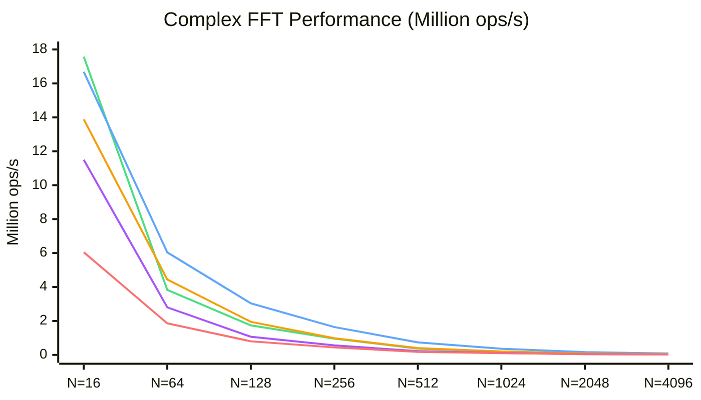
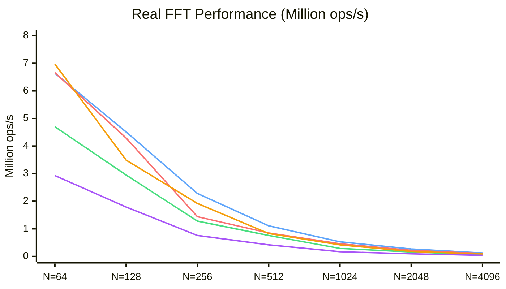

# wat-fft

A high-performance FFT implementation in WebAssembly Text format that **significantly outperforms popular JavaScript FFT libraries**.

## Performance

### Complex FFT

Benchmarked against [pffft-wasm](https://www.npmjs.com/package/@echogarden/pffft-wasm) (PFFFT with SIMD):

| Size   | wat-fft (f32)        | pffft-wasm (f32) | Speedup  |
| ------ | -------------------- | ---------------- | -------- |
| N=16   | **16,700,000 ops/s** | 13,900,000 ops/s | **+20%** |
| N=64   | **6,040,000 ops/s**  | 4,440,000 ops/s  | **+36%** |
| N=128  | **3,040,000 ops/s**  | 1,950,000 ops/s  | **+56%** |
| N=256  | **1,640,000 ops/s**  | 980,000 ops/s    | **+67%** |
| N=512  | **736,000 ops/s**    | 404,000 ops/s    | **+82%** |
| N=1024 | **365,000 ops/s**    | 201,000 ops/s    | **+81%** |
| N=2048 | **163,000 ops/s**    | 84,000 ops/s     | **+94%** |
| N=4096 | **81,000 ops/s**     | 41,000 ops/s     | **+95%** |



> 🟢 **wat-fft f64** · 🔵 **wat-fft f32** · 🟠 **pffft-wasm** · 🟣 **fft.js** · 🔴 **kissfft-js**

**wat-fft f32 beats pffft-wasm by 20-95%** across all sizes. It's also **2-3x faster** than fft.js (the fastest pure JS). **Choose f64** (`fft_combined.wasm`) for double precision. **Choose f32** (`fft_stockham_f32_dual.wasm`) for maximum single-precision speed.

### Real FFT

Benchmarked against [pffft-wasm](https://www.npmjs.com/package/@echogarden/pffft-wasm) and [fftw-js](https://www.npmjs.com/package/fftw-js):

| Size   | wat-fft (f32)       | pffft-wasm (f32)    | fftw-js (f32)   | vs best     |
| ------ | ------------------- | ------------------- | --------------- | ----------- |
| N=64   | 6,640,000 ops/s     | **6,970,000 ops/s** | 6,660,000 ops/s | -5% (pffft) |
| N=128  | **4,510,000 ops/s** | 3,490,000 ops/s     | 4,290,000 ops/s | **+5%**     |
| N=256  | **2,280,000 ops/s** | 1,920,000 ops/s     | 1,440,000 ops/s | **+19%**    |
| N=512  | **1,110,000 ops/s** | 830,000 ops/s       | 850,000 ops/s   | **+31%**    |
| N=1024 | **531,000 ops/s**   | 419,000 ops/s       | 458,000 ops/s   | **+16%**    |
| N=2048 | **274,000 ops/s**   | 179,000 ops/s       | 222,000 ops/s   | **+23%**    |
| N=4096 | **126,000 ops/s**   | 89,000 ops/s        | 106,000 ops/s   | **+19%**    |



> 🟢 **wat-fft f64** · 🔵 **wat-fft f32** · 🔴 **fftw-js** · 🟠 **pffft-wasm** · 🟣 **kissfft-js**

**wat-fft f32 beats all competitors at N≥128** (+5% to +31%). At N=64, pffft-wasm has a slight edge. **Choose f64** (`fft_real_combined.wasm`) for double precision. **Choose f32** (`fft_real_f32_dual.wasm`) for maximum single-precision speed.

## Quick Start

```bash
# Install dependencies
npm install

# Build WASM modules
npm run build

# Run tests
npm test

# Run benchmarks
npm run bench
```

### Prerequisites

- Node.js v18+
- [wasm-tools](https://github.com/bytecodealliance/wasm-tools)

```bash
cargo install wasm-tools
```

## Usage

```javascript
import fs from "fs";

// Load the WASM module
// No JavaScript imports needed - trig functions are computed inline
const wasmBuffer = fs.readFileSync("dist/fft_combined.wasm");
const wasmModule = await WebAssembly.compile(wasmBuffer);
const instance = await WebAssembly.instantiate(wasmModule);
const fft = instance.exports;

// Prepare input (interleaved complex: [re0, im0, re1, im1, ...])
const N = 1024;
const data = new Float64Array(fft.memory.buffer, 0, N * 2);
for (let i = 0; i < N; i++) {
  data[i * 2] = Math.sin((2 * Math.PI * i) / N); // real
  data[i * 2 + 1] = 0; // imaginary
}

// Compute FFT
fft.precompute_twiddles(N);
fft.fft(N);

// Results are in-place in data[]
console.log("DC component:", data[0], data[1]);

// Compute inverse FFT (roundtrip back to original)
fft.ifft(N);
console.log("Recovered signal:", data[0], data[1]);
```

## Implementations

**Recommended modules:**

| Module                       | Use Case                   | Precision | Inverse      |
| ---------------------------- | -------------------------- | --------- | ------------ |
| `fft_combined.wasm`          | Complex FFT (any size)     | f64       | `ifft`       |
| `fft_real_combined.wasm`     | Real FFT (any size)        | f64       | -            |
| `fft_stockham_f32_dual.wasm` | Complex FFT (interleaved)  | f32       | `ifft`       |
| `fft_split_native_f32.wasm`  | Complex FFT (split format) | f32       | `ifft_split` |
| `fft_real_f32_dual.wasm`     | Real FFT (fastest)         | f32       | `irfft`      |

**Split-format** (`fft_split_native_f32.wasm`) stores real and imaginary parts in separate arrays, enabling 4 complex numbers per SIMD operation. Performance is similar to interleaved format - use when your data is already in split format to avoid conversion overhead.

See [docs/IMPLEMENTATIONS.md](docs/IMPLEMENTATIONS.md) for detailed documentation of all modules, usage examples, and numerical accuracy information.

## How It Works

See [docs/HOW_IT_WORKS.md](docs/HOW_IT_WORKS.md) for algorithm details including:

- Real FFT algorithm (N-point real using N/2-point complex)
- Memory layout and buffer organization
- SIMD complex multiply implementation
- Stockham and Radix-4 FFT algorithms
- Taylor series trigonometry

## Scripts

```bash
npm run build         # Build all WASM modules
npm test              # Run all tests
npm run bench         # Run complex FFT benchmarks
npm run bench:rfft    # Run real FFT benchmarks
npm run bench:rfft32  # Run f32 real FFT benchmarks
npm run test:fft      # Run comprehensive FFT tests
npm run test:rfft     # Run real FFT tests
```

## Development Tools

| Documentation                                          | Description                              |
| ------------------------------------------------------ | ---------------------------------------- |
| [benchmarks/README.md](benchmarks/README.md)           | Performance benchmarks and profiling     |
| [tools/README.md](tools/README.md)                     | Debug tools for FFT development          |
| [docs/OPTIMIZATION_PLAN.md](docs/OPTIMIZATION_PLAN.md) | Optimization strategy and experiment log |

## Playground

An interactive browser-based playground is available for testing FFT performance with real-world tasks like spectrogram generation.

```bash
cd playground
npm install
npm run dev
```

Features:

- **Multiple FFT implementations**: Compare performance of different wat-fft modules
- **Audio sources**: Generate synthetic sine wave combinations using Web Audio API's OfflineAudioContext, or load your own audio files
- **Spectrogram visualization**: Real-time spectrogram rendering with configurable FFT size, hop size, and color scales
- **Spectrum analyzer**: Live microphone input with bar, curve, and mirrored visualization modes
- **Performance metrics**: Track FFT execution time and throughput

Add your own sample audio files to `playground/public/samples/`.

## Testing FFT Implementations

The comprehensive FFT test suite (`tests/fft.test.js`) tests all implementations against a reference DFT with various input sizes and patterns.

### Run all FFT tests

```bash
npm run test:fft
```

### Test a specific size and pattern

```bash
node tests/fft.test.js 64 random
node tests/fft.test.js 256 impulse
```

### Input patterns

- `impulse` - Single 1.0 at index 0
- `constant` - All 1.0 values
- `singleFreq` - Single cosine wave
- `random` - Seeded pseudorandom values

### Test sizes

Powers of 2: 4, 8, 16, 32, 64, 128, 256, 512, 1024, 2048, 4096, 8192

## License

ISC
