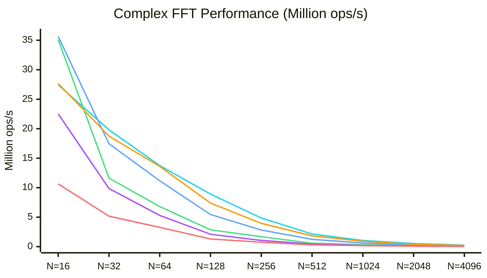
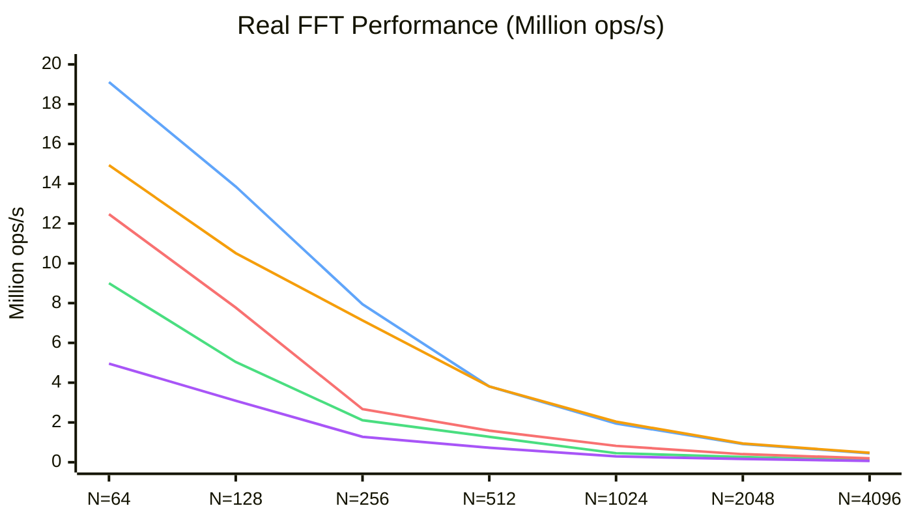

# wat-fft

A high-performance FFT implementation in WebAssembly Text format that is **the fastest complex FFT at every size** — beating every JavaScript library by 2-5x and pffft-wasm's SIMD build at all sizes.

> **Note on benchmark history**: results prior to 2026-07-06 compared against pffft-wasm's
> non-SIMD build (the package's default export). All numbers below race the SIMD build —
> see Experiments 57-58 in the [experiment log](docs/optimization/EXPERIMENT_LOG.md).

## Performance

### Complex FFT

Benchmarked against [pffft-wasm](https://www.npmjs.com/package/@echogarden/pffft-wasm) (PFFFT, SIMD build). The radix-4 split-format core (Experiment 58) is the fastest at N≥32; the interleaved dual-complex module wins at N=16.

| Size   | wat-fft (best)       | pffft-wasm SIMD (f32) | Result   |
| ------ | -------------------- | --------------------- | -------- |
| N=16   | **35,600,000 ops/s** | 27,700,000 ops/s      | **+29%** |
| N=32   | **19,800,000 ops/s** | 18,800,000 ops/s      | **+6%**  |
| N=64   | **13,800,000 ops/s** | 13,600,000 ops/s      | **+1%**  |
| N=128  | **8,910,000 ops/s**  | 7,390,000 ops/s       | **+21%** |
| N=256  | **4,860,000 ops/s**  | 3,950,000 ops/s       | **+23%** |
| N=512  | **2,150,000 ops/s**  | 1,830,000 ops/s       | **+18%** |
| N=1024 | **1,050,000 ops/s**  | 913,000 ops/s         | **+15%** |
| N=2048 | **538,000 ops/s**    | 404,000 ops/s         | **+33%** |
| N=4096 | **251,000 ops/s**    | 188,000 ops/s         | **+34%** |


```mermaid
---
config:
    xyChart:
        width: 700
        height: 400
    themeVariables:
        xyChart:
            plotColorPalette: "#4ade80, #22d3ee, #60a5fa, #f59e0b, #a855f7, #f87171"
---
xychart-beta
    title "Complex FFT Performance (Million ops/s)"
    x-axis [N=16, N=32, N=64, N=128, N=256, N=512, N=1024, N=2048, N=4096]
    y-axis "Million ops/s" 0 --> 36
    line [35.11, 11.63, 6.80, 2.85, 1.69, 0.586, 0.330, 0.124, 0.073]
    line [27.44, 19.81, 13.75, 8.91, 4.86, 2.15, 1.05, 0.538, 0.251]
    line [35.65, 17.46, 11.17, 5.45, 2.82, 1.24, 0.620, 0.273, 0.133]
    line [27.66, 18.75, 13.61, 7.39, 3.95, 1.83, 0.913, 0.404, 0.188]
    line [22.52, 9.86, 5.30, 2.10, 1.06, 0.429, 0.216, 0.090, 0.045]
    line [10.64, 5.17, 3.27, 1.30, 0.758, 0.299, 0.168, 0.067, 0.037]
```

> 🟢 **wat-fft f64** · 🩵 **wat-fft f32 split** · 🔵 **wat-fft f32** · 🟠 **pffft-wasm SIMD** · 🟣 **fft.js** · 🔴 **kissfft-js**

**Choose f64** (`fft_combined.wasm`) for double precision. **Choose the split-format f32 module** (`fft_split_native_f32.wasm`) for maximum speed at N≥32 (separate re/im arrays). **Choose interleaved f32** (`fft_stockham_f32_dual.wasm`) for interleaved data or N=16.

The f32 inverse (`ifft`) is a native inverse transform (conjugated twiddles, no extra conjugate/scale passes) and runs at the same speed as the forward FFT.

### Real FFT

Benchmarked against [pffft-wasm](https://www.npmjs.com/package/@echogarden/pffft-wasm) (SIMD build) and [fftw-js](https://www.npmjs.com/package/fftw-js):

| Size   | wat-fft (f32)        | pffft-wasm SIMD (f32) | Result   |
| ------ | -------------------- | --------------------- | -------- |
| N=64   | **19,100,000 ops/s** | 14,200,000 ops/s      | **+35%** |
| N=128  | **13,900,000 ops/s** | 10,600,000 ops/s      | **+31%** |
| N=256  | **7,940,000 ops/s**  | 7,180,000 ops/s       | **+10%** |
| N=512  | 3,810,000 ops/s      | 3,850,000 ops/s       | -1%      |
| N=1024 | 1,950,000 ops/s      | 2,070,000 ops/s       | -5%      |
| N=2048 | 914,000 ops/s        | 946,000 ops/s         | -3%      |
| N=4096 | 452,000 ops/s        | 475,000 ops/s         | -5%      |


```mermaid
---
config:
    xyChart:
        width: 700
        height: 400
    themeVariables:
        xyChart:
            plotColorPalette: "#4ade80, #60a5fa, #f87171, #f59e0b, #a855f7"
---
xychart-beta
    title "Real FFT Performance (Million ops/s)"
    x-axis [N=64, N=128, N=256, N=512, N=1024, N=2048, N=4096]
    y-axis "Million ops/s" 0 --> 20
    line [9.00, 5.04, 2.11, 1.28, 0.456, 0.262, 0.099]
    line [19.11, 13.86, 7.94, 3.81, 1.95, 0.914, 0.452]
    line [12.47, 7.77, 2.67, 1.59, 0.824, 0.407, 0.197]
    line [14.93, 10.51, 7.13, 3.81, 2.04, 0.941, 0.474]
    line [4.96, 3.09, 1.28, 0.732, 0.293, 0.163, 0.066]
```

> 🟢 **wat-fft f64** · 🔵 **wat-fft f32** · 🔴 **fftw-js** · 🟠 **pffft-wasm SIMD** · 🟣 **kissfft-js**

**wat-fft f32 wins at N≤256 and beats fftw-js at every size by +53% to +193%.** The forward real FFT (`rfft_split` in the split-format module, Experiment 59) runs on the radix-4 split core with a fused deinterleaving first stage and no copy-back passes; it roughly doubled throughput at N≥128 and now sits within 1-5% of pffft-wasm SIMD at N=512-4096 (fusing the post-process into the final stage is the identified next step). **Choose f64** (`fft_real_combined.wasm`) for double precision. **Choose f32** (`fft_split_native_f32.wasm`, `rfft_split`/`irfft_split`) for maximum single-precision speed; `fft_real_f32_dual.wasm` remains for N<32.

The inverse real FFT (`irfft_split`, Experiment 60) mirrors the forward design — a fused SIMD pre-process with the 1/N normalization folded in and a final butterfly stage fused with the reinterleave. It beats fftw-js at every size (+39% to +115%) and pffft-wasm SIMD at N≤128, trailing it by only 3-17% at N≥256 (pffft's backward transform skips normalization entirely). See [docs/OPTIMIZATION_PLAN.md](docs/OPTIMIZATION_PLAN.md) for current tables.

## Installation

```bash
npm install @emnudge/wat-fft
```

## Usage

### High-Level API (Recommended)

The high-level API handles WASM loading, memory management, and twiddle factor precomputation automatically.

#### Node.js

```typescript
import { createRFFTf32 } from "@emnudge/wat-fft";

// Create an FFT context for size 1024
const fft = await createRFFTf32(1024);

// Get the input buffer and fill with samples
const input = fft.getInputBuffer();
for (let i = 0; i < 1024; i++) {
  input[i] = Math.sin((2 * Math.PI * i * 10) / 1024);
}

// Compute FFT
fft.forward();

// Read results (interleaved complex: [re0, im0, re1, im1, ...])
const output = fft.getOutputBuffer(); // Length: (1024/2 + 1) * 2 = 1026

// Compute inverse FFT
fft.inverse();
```

#### Browser (with Vite, Webpack, etc.)

```typescript
import { createRFFTf32 } from "@emnudge/wat-fft/browser";
import wasmUrl from "@emnudge/wat-fft/wasm/rfft-f32.wasm?url";

const fft = await createRFFTf32(1024, wasmUrl);
const input = fft.getInputBuffer();
input.set(audioSamples);
fft.forward();
const spectrum = fft.getOutputBuffer();
```

### Available Factory Functions

| Function              | Precision | Input   | Best For                            |
| --------------------- | --------- | ------- | ----------------------------------- |
| `createFFT(size)`     | f64       | Complex | High-precision complex signals      |
| `createFFTf32(size)`  | f32       | Complex | Fast complex signal processing      |
| `createRFFT(size)`    | f64       | Real    | High-precision audio/real signals   |
| `createRFFTf32(size)` | f32       | Real    | Fast audio processing (recommended) |

### WASM Exports for Bundlers

For browser builds, import WASM files directly:

| Export Path                           | WASM Module       |
| ------------------------------------- | ----------------- |
| `@emnudge/wat-fft/wasm/fft.wasm`      | Complex FFT (f64) |
| `@emnudge/wat-fft/wasm/fft-f32.wasm`  | Complex FFT (f32) |
| `@emnudge/wat-fft/wasm/rfft.wasm`     | Real FFT (f64)    |
| `@emnudge/wat-fft/wasm/rfft-f32.wasm` | Real FFT (f32)    |

### Low-Level API (Advanced)

For users who need direct control over WASM memory and exports:

```typescript
import { createRFFTf32Instance } from "@emnudge/wat-fft";

const exports = await createRFFTf32Instance();

// Manual twiddle precomputation
exports.precompute_rfft_twiddles(1024);

// Direct memory access
const input = new Float32Array(exports.memory.buffer, 0, 1024);
input.set(samples);

// Execute FFT
exports.rfft(1024);

// Read output from same memory location
const output = new Float32Array(exports.memory.buffer, 0, 1026);
```

### TypeScript Support

Full TypeScript definitions are included. Key types:

```typescript
import type { FFT, FFTf32, RFFT, RFFTf32, FFTExports, RFFTf32Exports } from "@emnudge/wat-fft";
```

## Development

### Prerequisites

- Node.js v18+
- [wasm-tools](https://github.com/bytecodealliance/wasm-tools)

```bash
cargo install wasm-tools
```

### Quick Start

```bash
npm install        # Install dependencies
npm run build      # Build WASM modules
npm test           # Run tests
npm run bench      # Run benchmarks
```

## Implementations

**Recommended modules:**

| Module                       | Use Case                     | Precision | Inverse                     |
| ---------------------------- | ---------------------------- | --------- | --------------------------- |
| `fft_combined.wasm`          | Complex FFT (any size)       | f64       | `ifft`                      |
| `fft_real_combined.wasm`     | Real FFT (any size)          | f64       | -                           |
| `fft_stockham_f32_dual.wasm` | Complex FFT (interleaved)    | f32       | `ifft`                      |
| `fft_split_native_f32.wasm`  | Complex + real FFT (fastest) | f32       | `ifft_split`, `irfft_split` |
| `fft_real_f32_dual.wasm`     | Real FFT (N<32)              | f32       | `irfft`                     |

**Split-format** (`fft_split_native_f32.wasm`) stores real and imaginary parts in separate arrays. Its radix-4 core (Experiment 58) computes 4 complex numbers per SIMD operation with zero shuffles in the main stages, making it **the fastest complex FFT module at N≥32** — faster than both the interleaved module and pffft-wasm SIMD. Its `ifft_split` is a native inverse (conjugated stage tables + one 1/N scale pass). The same module hosts the fastest **real FFT in both directions** (N≥32, `precompute_rfft_twiddles_split` once): `rfft_split` (Experiment 59) takes packed real input at offset 0 and writes N/2+1 interleaved complex bins to offset 0; `irfft_split` (Experiment 60) takes those bins and writes the fully-normalized real signal back to offset 0.

See [docs/IMPLEMENTATIONS.md](docs/IMPLEMENTATIONS.md) for detailed documentation of all modules, usage examples, and numerical accuracy information.

## How It Works

See [docs/HOW_IT_WORKS.md](docs/HOW_IT_WORKS.md) for algorithm details including:

- Real FFT algorithm (N-point real using N/2-point complex)
- Memory layout and buffer organization
- SIMD complex multiply implementation
- Stockham and Radix-4 FFT algorithms
- Taylor series trigonometry

## Scripts

```bash
npm run build         # Build all WASM modules
npm test              # Run all tests
npm run bench         # Run complex FFT benchmarks
npm run bench:rfft    # Run real FFT benchmarks
npm run bench:rfft32  # Run f32 real FFT benchmarks
npm run test:fft      # Run comprehensive FFT tests
npm run test:rfft     # Run real FFT tests
```

## Development Tools

| Documentation                                          | Description                              |
| ------------------------------------------------------ | ---------------------------------------- |
| [benchmarks/README.md](benchmarks/README.md)           | Performance benchmarks and profiling     |
| [tools/README.md](tools/README.md)                     | Debug tools for FFT development          |
| [docs/OPTIMIZATION_PLAN.md](docs/OPTIMIZATION_PLAN.md) | Optimization strategy and experiment log |

## Playground

An interactive browser-based playground is available for testing FFT performance with real-world tasks like spectrogram generation.

```bash
cd playground
npm install
npm run dev
```

Features:

- **Multiple FFT implementations**: Compare performance of different wat-fft modules
- **Audio sources**: Generate synthetic sine wave combinations using Web Audio API's OfflineAudioContext, or load your own audio files
- **Spectrogram visualization**: Real-time spectrogram rendering with configurable FFT size, hop size, and color scales
- **Spectrum analyzer**: Live microphone input with bar, curve, and mirrored visualization modes
- **Performance metrics**: Track FFT execution time and throughput

Add your own sample audio files to `playground/public/samples/`.

## Testing FFT Implementations

The comprehensive FFT test suite (`tests/fft.test.js`) tests all implementations against a reference DFT with various input sizes and patterns.

### Run all FFT tests

```bash
npm run test:fft
```

### Test a specific size and pattern

```bash
node tests/fft.test.js 64 random
node tests/fft.test.js 256 impulse
```

### Input patterns

- `impulse` - Single 1.0 at index 0
- `constant` - All 1.0 values
- `singleFreq` - Single cosine wave
- `random` - Seeded pseudorandom values

### Test sizes

Powers of 2: 4, 8, 16, 32, 64, 128, 256, 512, 1024, 2048, 4096, 8192

## License

ISC
