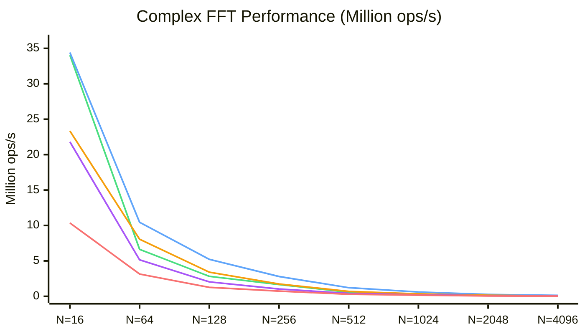
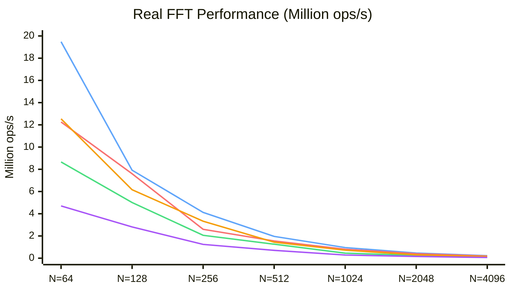

# wat-fft

A high-performance FFT implementation in WebAssembly Text format that **significantly outperforms popular JavaScript FFT libraries**.

## Performance

### Complex FFT

Benchmarked against [pffft-wasm](https://www.npmjs.com/package/@echogarden/pffft-wasm) (PFFFT with SIMD):

| Size   | wat-fft (f32)        | pffft-wasm (f32) | Speedup  |
| ------ | -------------------- | ---------------- | -------- |
| N=16   | **34,400,000 ops/s** | 23,300,000 ops/s | **+47%** |
| N=64   | **10,500,000 ops/s** | 8,060,000 ops/s  | **+30%** |
| N=128  | **5,220,000 ops/s**  | 3,410,000 ops/s  | **+53%** |
| N=256  | **2,800,000 ops/s**  | 1,740,000 ops/s  | **+61%** |
| N=512  | **1,220,000 ops/s**  | 695,000 ops/s    | **+76%** |
| N=1024 | **614,000 ops/s**    | 348,000 ops/s    | **+76%** |
| N=2048 | **270,000 ops/s**    | 148,000 ops/s    | **+82%** |
| N=4096 | **132,000 ops/s**    | 73,000 ops/s     | **+81%** |


```mermaid
---
config:
    xyChart:
        width: 700
        height: 400
    themeVariables:
        xyChart:
            plotColorPalette: "#4ade80, #60a5fa, #f59e0b, #a855f7, #f87171"
---
xychart-beta
    title "Complex FFT Performance (Million ops/s)"
    x-axis [N=16, N=64, N=128, N=256, N=512, N=1024, N=2048, N=4096]
    y-axis "Million ops/s" 0 --> 36
    line [34.04, 6.63, 2.82, 1.67, 0.579, 0.326, 0.118, 0.072]
    line [34.42, 10.45, 5.22, 2.80, 1.22, 0.614, 0.270, 0.132]
    line [23.34, 8.06, 3.41, 1.74, 0.695, 0.348, 0.148, 0.073]
    line [21.80, 5.15, 2.04, 1.03, 0.419, 0.210, 0.088, 0.044]
    line [10.36, 3.15, 1.27, 0.734, 0.293, 0.161, 0.066, 0.036]
```

> 🟢 **wat-fft f64** · 🔵 **wat-fft f32** · 🟠 **pffft-wasm** · 🟣 **fft.js** · 🔴 **kissfft-js**

**wat-fft f32 beats pffft-wasm by 30-82%** across all sizes. It's also **2-3x faster** than fft.js (the fastest pure JS). **Choose f64** (`fft_combined.wasm`) for double precision. **Choose f32** (`fft_stockham_f32_dual.wasm`) for maximum single-precision speed.

The f32 inverse (`ifft`) is a native inverse transform (conjugated twiddles, no extra conjugate/scale passes) and runs at the same speed as the forward FFT — 36-85% faster than pffft-wasm's unscaled backward transform.

### Real FFT

Benchmarked against [pffft-wasm](https://www.npmjs.com/package/@echogarden/pffft-wasm) and [fftw-js](https://www.npmjs.com/package/fftw-js):

| Size   | wat-fft (f32)        | pffft-wasm (f32) | fftw-js (f32)    | vs best          |
| ------ | -------------------- | ---------------- | ---------------- | ---------------- |
| N=64   | **19,500,000 ops/s** | 12,500,000 ops/s | 12,300,000 ops/s | **+56%** (pffft) |
| N=128  | **7,920,000 ops/s**  | 6,160,000 ops/s  | 7,600,000 ops/s  | **+4%** (fftw)   |
| N=256  | **4,120,000 ops/s**  | 3,330,000 ops/s  | 2,600,000 ops/s  | **+24%** (pffft) |
| N=512  | **1,960,000 ops/s**  | 1,440,000 ops/s  | 1,550,000 ops/s  | **+27%** (fftw)  |
| N=1024 | **955,000 ops/s**    | 717,000 ops/s    | 807,000 ops/s    | **+18%** (fftw)  |
| N=2048 | **459,000 ops/s**    | 301,000 ops/s    | 403,000 ops/s    | **+14%** (fftw)  |
| N=4096 | **220,000 ops/s**    | 143,000 ops/s    | 190,000 ops/s    | **+16%** (fftw)  |


```mermaid
---
config:
    xyChart:
        width: 700
        height: 400
    themeVariables:
        xyChart:
            plotColorPalette: "#4ade80, #60a5fa, #f87171, #f59e0b, #a855f7"
---
xychart-beta
    title "Real FFT Performance (Million ops/s)"
    x-axis [N=64, N=128, N=256, N=512, N=1024, N=2048, N=4096]
    y-axis "Million ops/s" 0 --> 20
    line [8.66, 5.01, 2.06, 1.26, 0.451, 0.257, 0.095]
    line [19.48, 7.92, 4.12, 1.96, 0.955, 0.459, 0.220]
    line [12.26, 7.60, 2.60, 1.55, 0.807, 0.403, 0.190]
    line [12.54, 6.16, 3.33, 1.44, 0.717, 0.301, 0.143]
    line [4.70, 2.81, 1.24, 0.707, 0.283, 0.156, 0.064]
```

> 🟢 **wat-fft f64** · 🔵 **wat-fft f32** · 🔴 **fftw-js** · 🟠 **pffft-wasm** · 🟣 **kissfft-js**

**wat-fft f32 beats every competitor at every size** (+4% to +56% vs the best of pffft-wasm/fftw-js). **Choose f64** (`fft_real_combined.wasm`) for double precision. **Choose f32** (`fft_real_f32_dual.wasm`) for maximum single-precision speed.

On Apple M5 Pro (Node v24), wat-fft beats fftw-js at **every** size in both directions: forward +4% to +57%, and the inverse real FFT (`irfft`, a native inverse transform with no conjugate/scale pass) +4% to +54%. See [docs/OPTIMIZATION_PLAN.md](docs/OPTIMIZATION_PLAN.md) for current tables.

## Installation

```bash
npm install @emnudge/wat-fft
```

## Usage

### High-Level API (Recommended)

The high-level API handles WASM loading, memory management, and twiddle factor precomputation automatically.

#### Node.js

```typescript
import { createRFFTf32 } from "@emnudge/wat-fft";

// Create an FFT context for size 1024
const fft = await createRFFTf32(1024);

// Get the input buffer and fill with samples
const input = fft.getInputBuffer();
for (let i = 0; i < 1024; i++) {
  input[i] = Math.sin((2 * Math.PI * i * 10) / 1024);
}

// Compute FFT
fft.forward();

// Read results (interleaved complex: [re0, im0, re1, im1, ...])
const output = fft.getOutputBuffer(); // Length: (1024/2 + 1) * 2 = 1026

// Compute inverse FFT
fft.inverse();
```

#### Browser (with Vite, Webpack, etc.)

```typescript
import { createRFFTf32 } from "@emnudge/wat-fft/browser";
import wasmUrl from "@emnudge/wat-fft/wasm/rfft-f32.wasm?url";

const fft = await createRFFTf32(1024, wasmUrl);
const input = fft.getInputBuffer();
input.set(audioSamples);
fft.forward();
const spectrum = fft.getOutputBuffer();
```

### Available Factory Functions

| Function              | Precision | Input   | Best For                            |
| --------------------- | --------- | ------- | ----------------------------------- |
| `createFFT(size)`     | f64       | Complex | High-precision complex signals      |
| `createFFTf32(size)`  | f32       | Complex | Fast complex signal processing      |
| `createRFFT(size)`    | f64       | Real    | High-precision audio/real signals   |
| `createRFFTf32(size)` | f32       | Real    | Fast audio processing (recommended) |

### WASM Exports for Bundlers

For browser builds, import WASM files directly:

| Export Path                           | WASM Module       |
| ------------------------------------- | ----------------- |
| `@emnudge/wat-fft/wasm/fft.wasm`      | Complex FFT (f64) |
| `@emnudge/wat-fft/wasm/fft-f32.wasm`  | Complex FFT (f32) |
| `@emnudge/wat-fft/wasm/rfft.wasm`     | Real FFT (f64)    |
| `@emnudge/wat-fft/wasm/rfft-f32.wasm` | Real FFT (f32)    |

### Low-Level API (Advanced)

For users who need direct control over WASM memory and exports:

```typescript
import { createRFFTf32Instance } from "@emnudge/wat-fft";

const exports = await createRFFTf32Instance();

// Manual twiddle precomputation
exports.precompute_rfft_twiddles(1024);

// Direct memory access
const input = new Float32Array(exports.memory.buffer, 0, 1024);
input.set(samples);

// Execute FFT
exports.rfft(1024);

// Read output from same memory location
const output = new Float32Array(exports.memory.buffer, 0, 1026);
```

### TypeScript Support

Full TypeScript definitions are included. Key types:

```typescript
import type { FFT, FFTf32, RFFT, RFFTf32, FFTExports, RFFTf32Exports } from "@emnudge/wat-fft";
```

## Development

### Prerequisites

- Node.js v18+
- [wasm-tools](https://github.com/bytecodealliance/wasm-tools)

```bash
cargo install wasm-tools
```

### Quick Start

```bash
npm install        # Install dependencies
npm run build      # Build WASM modules
npm test           # Run tests
npm run bench      # Run benchmarks
```

## Implementations

**Recommended modules:**

| Module                       | Use Case                   | Precision | Inverse      |
| ---------------------------- | -------------------------- | --------- | ------------ |
| `fft_combined.wasm`          | Complex FFT (any size)     | f64       | `ifft`       |
| `fft_real_combined.wasm`     | Real FFT (any size)        | f64       | -            |
| `fft_stockham_f32_dual.wasm` | Complex FFT (interleaved)  | f32       | `ifft`       |
| `fft_split_native_f32.wasm`  | Complex FFT (split format) | f32       | `ifft_split` |
| `fft_real_f32_dual.wasm`     | Real FFT (fastest)         | f32       | `irfft`      |

**Split-format** (`fft_split_native_f32.wasm`) stores real and imaginary parts in separate arrays, enabling 4 complex numbers per SIMD operation. Performance is similar to interleaved format - use when your data is already in split format to avoid conversion overhead.

See [docs/IMPLEMENTATIONS.md](docs/IMPLEMENTATIONS.md) for detailed documentation of all modules, usage examples, and numerical accuracy information.

## How It Works

See [docs/HOW_IT_WORKS.md](docs/HOW_IT_WORKS.md) for algorithm details including:

- Real FFT algorithm (N-point real using N/2-point complex)
- Memory layout and buffer organization
- SIMD complex multiply implementation
- Stockham and Radix-4 FFT algorithms
- Taylor series trigonometry

## Scripts

```bash
npm run build         # Build all WASM modules
npm test              # Run all tests
npm run bench         # Run complex FFT benchmarks
npm run bench:rfft    # Run real FFT benchmarks
npm run bench:rfft32  # Run f32 real FFT benchmarks
npm run test:fft      # Run comprehensive FFT tests
npm run test:rfft     # Run real FFT tests
```

## Development Tools

| Documentation                                          | Description                              |
| ------------------------------------------------------ | ---------------------------------------- |
| [benchmarks/README.md](benchmarks/README.md)           | Performance benchmarks and profiling     |
| [tools/README.md](tools/README.md)                     | Debug tools for FFT development          |
| [docs/OPTIMIZATION_PLAN.md](docs/OPTIMIZATION_PLAN.md) | Optimization strategy and experiment log |

## Playground

An interactive browser-based playground is available for testing FFT performance with real-world tasks like spectrogram generation.

```bash
cd playground
npm install
npm run dev
```

Features:

- **Multiple FFT implementations**: Compare performance of different wat-fft modules
- **Audio sources**: Generate synthetic sine wave combinations using Web Audio API's OfflineAudioContext, or load your own audio files
- **Spectrogram visualization**: Real-time spectrogram rendering with configurable FFT size, hop size, and color scales
- **Spectrum analyzer**: Live microphone input with bar, curve, and mirrored visualization modes
- **Performance metrics**: Track FFT execution time and throughput

Add your own sample audio files to `playground/public/samples/`.

## Testing FFT Implementations

The comprehensive FFT test suite (`tests/fft.test.js`) tests all implementations against a reference DFT with various input sizes and patterns.

### Run all FFT tests

```bash
npm run test:fft
```

### Test a specific size and pattern

```bash
node tests/fft.test.js 64 random
node tests/fft.test.js 256 impulse
```

### Input patterns

- `impulse` - Single 1.0 at index 0
- `constant` - All 1.0 values
- `singleFreq` - Single cosine wave
- `random` - Seeded pseudorandom values

### Test sizes

Powers of 2: 4, 8, 16, 32, 64, 128, 256, 512, 1024, 2048, 4096, 8192

## License

ISC
